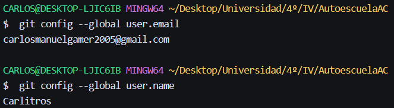

# Configuración del entorno

Este documento recoge cómo he preparado el entorno de trabajo

## Identidad del git

## Licencia y .gitignore

### Licencia
Uso la licencia **MIT** (fichero `LICENSE`, en la raíz). Es una licencia
libre y permisiva: permite usar, copiar, modificar y distribuir el
software, con la única condición de conservar el aviso de copyright.
La elijo porque no impone condiciones a proyectos derivados y es
suficiente para un trabajo académico. 

### .gitignore
Su contenido es genérico (`.DS_Store`, `*.log`, `.env`, `node_modules/`,
`__pycache__/`) porque todavía no he decidido el lenguaje ni la
tecnología de despliegue. Lo revisaré cuando se fijen.

## Configuración

