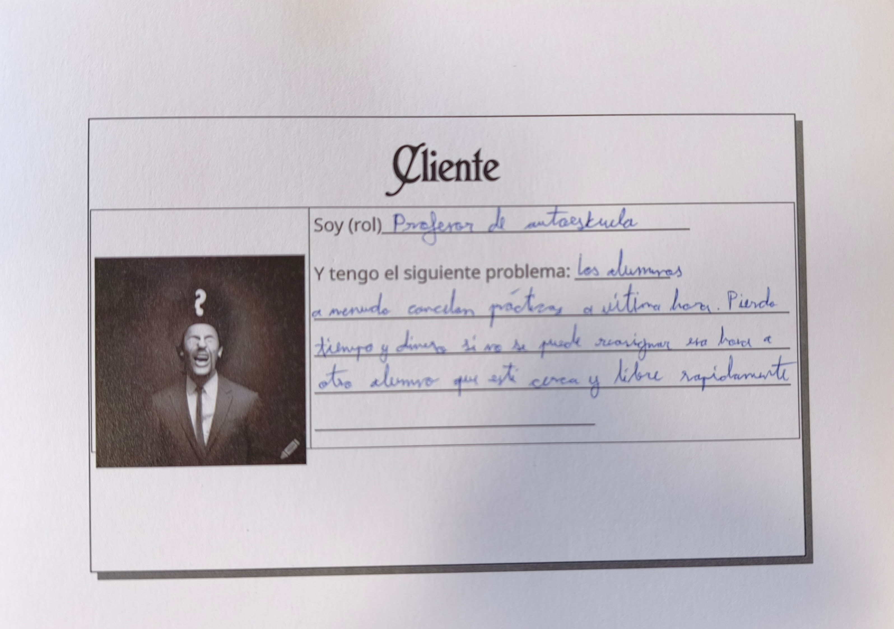
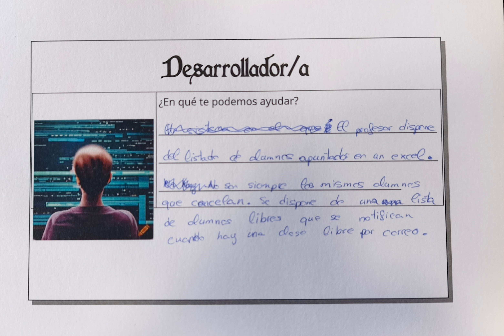

# AutoescuelaAC

## Rol
Soy un profesor de autoescuela.

## Problema

Los alumnos a menudo cancelan las prácticas a última hora, por lo tanto pierdo tiempo y 
dinero si no consigo reasignar esa hora a otro alumno que esté cerca y libre rapidamente.

**Datos reales del problema: **
- Clases prácticas de 45 minutos, con 10 o 12 clases al día (unas 50-60 a la semana,
  suponiendo 5 días lectivos).
- 25 alumnos en prácticas, que van rotando.
- Cancelan de media 3 alumnos por semana, y no siempre los mismos.
- Precio de la clase: unos 25 €.

Con estas cifras se pierden de media 3 × 45 min = 2 h 15 min de clase a la semana, unos 75 €
(alrededor de 300 € al mes), es decir, entre el 5 % y el 6 % de las clases semanales, además de
tener el vehículo parado en esa franja.

## Un caso concreto
Tengo una práctica de 17:00 a 18:00 y el alumno
avisa a las 16:10 de que no puede venir. Tengo 50 minutos para
encontrar a alguien que necesite prácticas, esté libre a esa hora y
pueda llegar al punto de recogida a tiempo. Hoy eso significa ir
escribiendo a alumnos uno a uno sin saber a priori cuál es el candidato
adecuado; si no responde nadie a tiempo, la hora se pierde.

## Mi relación con el problema
Debido a que mi padre es profesor de autoescuela he podido vivir esta situación
de primera mano y la mayoria de las veces acaba perdiendo ese hueco en el
que podria tener otro alumno en el que dar clase, a no ser de que este avise con
suficiente antelación, lo que provoca una perdida
monetaria y de tiempo al ahora no tener nada que hacer.

## Por qué el método actual falla
- No sé quién está libre sin preguntar uno a uno.
- No sé quién está cerca sin consultar a mano su ubicación.
- No sé a quién le conviene más la hora (prácticas pendientes).
- Cada consulta lleva minutos, y el margen es de decenas de minutos.

## A quién afecta
- Profesor: hora sin ingreso y tiempo dedicado a gestionarla.
- Autoescuela: vehículo parado en esa franja.
- Alumnos con ganas de más prácticas: no saben que ha surgido un hueco.

## Datos de partida
Según la tarjeta de rol de desarrollador (ver abajo), se dispone de:
- Un listado de alumnos apuntados, mantenido en un Excel.
- Una lista de alumnos libres, a los que se avisa por correo cuando
  queda una clase libre.

Los alumnos que cancelan no son siempre los mismos, por lo que no hay un
patrón previo que permita anticipar cancelaciones: el sistema tiene que
reaccionar a cada una.

## Por qué no basta una aplicación local
Profesor y alumnos usan dispositivos distintos y actúan en momentos
distintos: la cancelación, la oferta y la aceptación deben encontrarse
en un punto común y accesible en tiempo real.

## Qué habría que calcular
Ante una cancelación, el sistema debería resolver, sin intervención manual:

- **Filtrar** la lista de alumnos para quedarse con los que están libres
  en la franja cancelada y todavía necesitan prácticas.
- **Calcular** si cada candidato puede llegar al punto de recogida a
  tiempo, según su ubicación y el margen que queda hasta la hora de inicio.
- **Validar** que la reasignación es posible: duración de la franja,
  que el alumno no tenga otra clase a esa hora y que el tipo de práctica
  encaje.
- **Analizar** a los candidatos que quedan para ordenarlos por prioridad
  (por ejemplo, prácticas pendientes).
- **Generar** una propuesta ordenada y **resumirla** para el profesor, de
  modo que pueda decidir en segundos a quién ofrecer la hora.

Avisar al alumno es solo el último paso; el valor está en decidir
a quién avisar.

## Planificación del proyecto
El proyecto se ha planificado en historias de usuario, milestones y user
journeys, siguiendo el objetivo 1 de la asignatura:
- [User journeys](docs/user-journeys.md)
- [Personas](docs/personas.md)
- [Milestones](docs/milestones.md)

## Configuración
La configuración del entorno de desarrollo se detalla en [CONFIGURACION.md](CONFIGURACION.md).